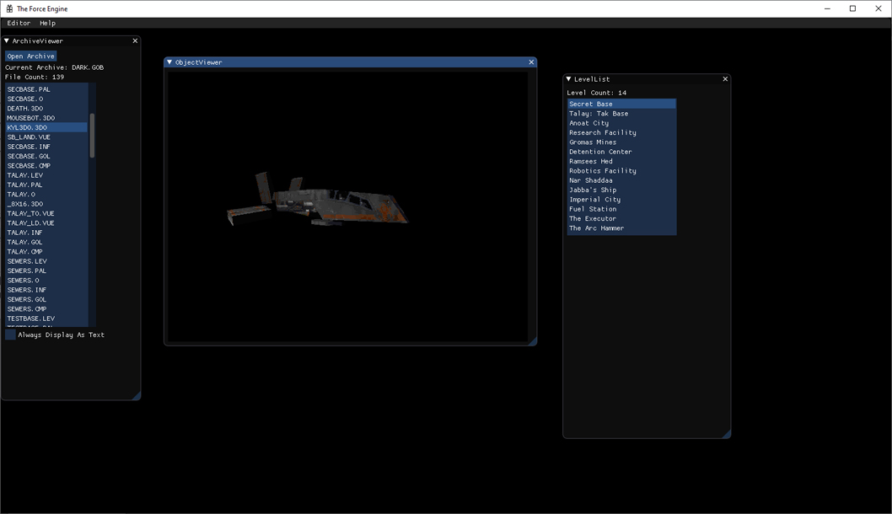
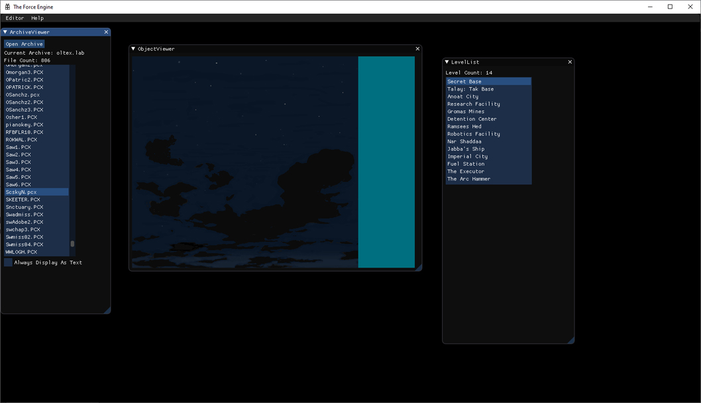

[Dark Forces and Mods](#dark-forces-and-mods) 
[Asset Editor](#asset-editor) 
[Level Editor](#level-editor)

## Dark Forces and Mods
<table style="width:100%">
  <tr>
    <th></th>
    <th></th>
  </tr>
  <tr>
    <th></th>
    <th></th>
  </tr>
  <tr>
    <th></th>
    <th></th>
  </tr>
  <tr>
    <th></th>
    <th></th>
  </tr>
  <tr>
    <th></th>
    <th></th>
  </tr>
</table>
<a href="https://theforceengine.github.io/media.html">Top</a>

## Asset Editor
<table style="width:100%">
  <tr>
    <th></th>
    <th></th>
  </tr>
  <tr>
    <th></th>
    <th></th>
  </tr>
</table>
<a href="https://theforceengine.github.io/media.html">Top</a>

## Level Editor
<table style="width:100%">
  <tr>
    <th></th>
    <th></th>
  </tr>
  <tr>
    <th></th>
    <th></th>
  </tr>
  <tr>
    <th></th>
  </tr>
</table>
<a href="https://theforceengine.github.io/media.html">Top</a>
